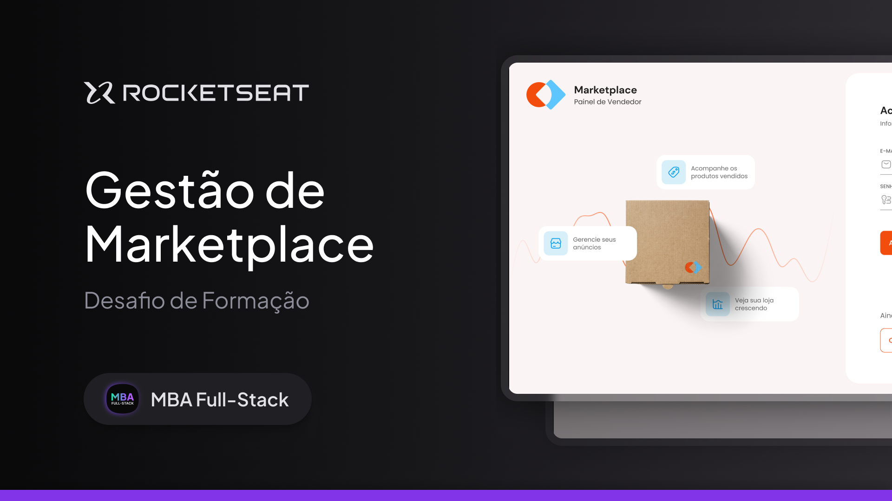

<p align="center">  
    
</p>

<div align="center">


</div>

## 📖 Sobre

Projeto 15 do [MBA Rocketseat Full-stack](https://www.rocketseat.com.br/mba) como resolução do desafio prático do módulo Web-Frontend, envolvendo fundamentos do React.js, consumo de APIs, React Hook Form, React Query e testes automatizados.

O desafio consiste em desenvolver uma aplicação web de um dashboard de gestão de vendas de produtos: o **Marketplace**.

<p align="center">  
    
</p>

## 👨🏻‍💻 Tecnologias utilizadas

Foram utilizadas as seguintes tecnologias para desenvolvimento do projeto:

- [React.js](https://react.dev/)
- [TypeScript](https://www.typescriptlang.org/)
- [shadcn/ui](https://ui.shadcn.com/) - Componentes
- [tailwindcss](https://tailwindcss.com/) - Estilos
- [React Hook Form](https://www.react-hook-form.com/) - Formulário
- [Zod](https://zod.dev/) - Validação de Schema
- [Axios](https://axios-http.com/) - Chamadas de API
- [React Query](https://tanstack.com/query/) - Cache de API
- [Recharts](https://recharts.org/) - Gráficos
- [Sonner](https://sonner.emilkowal.ski/) - Toast de notificação
- [react-helmet-async](https://github.com/staylor/react-helmet-async) - Título das Páginas

## 🚀 Como Executar o Projeto

Para executar o projeto, o ambiente deve estar configurado com as ferramentas de desenvolvimento de aplicativos.

O projeto possui dependência do backend para a execução, então será necessário clonar o repositório abaixo e seguir as instruções contidas no README:

- [https://github.com/rocketseat-education/mba-marketplace-server](https://github.com/rocketseat-education/mba-marketplace-server)

Após clonar o repositório acima e executa-lo, seguir com:

```bash
# Clonar o repositório
git clone https://github.com/danilosalvador/marketplace-web

# Entrar no diretório
cd marketplace-web

# Baixar as dependências
npm install

# Executar
npm run dev

```

O login e senha do usuário criado pela seed é:
- Email: `seller@mba.com`
- Senha: `123456`

## 📺 Demonstração

<video src="https://youtu.be/N93Gt8Xegys"></video>

## 📝 Licença
Esse projeto está sob a licença MIT. Veja o arquivo [LICENSE](LICENSE) para mais detalhes.